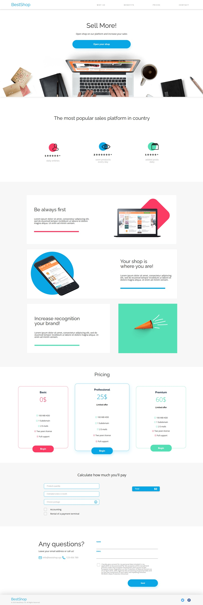

# 🛍️ BestShop - A responsive e-commerce website

BestShop is a modern, responsive e-commerce landing page featuring a real-time **pricing calculator**.

## Features
- Fully responsive layout for mobile, tablet and desktop
- Interactive JavaScript **pricing calculator**
- Clean and modern design with SASS 
- Semantic HTML5 for accessibility 

## Built with 
- [HTML5](https://developer.mozilla.org/en-US/docs/Web/Guide/HTML/HTML5)
- [SASS](https://sass-lang.com/)
- [JavaScript](https://developer.mozilla.org/en-US/docs/Web/JavaScript)
- [Vite](https://vitejs.dev/)

## Live Preview
--link--

## 🧮 Pricing Calculator 
The JavaScript-based Pricing Calculator allows users to:
- Select quantities of services or products
- Choose packages from a custom dropdown
- Instantly view the updated total in a dynamic summary

## Getting Started 
Follow these instructions to set up and run the project locally with **Vite**.

1. Clone the repository
2. Install dependencies, make sure you have Node.js installed
3. Run the developer server `npm run dev`

## Full-page screenshot 
